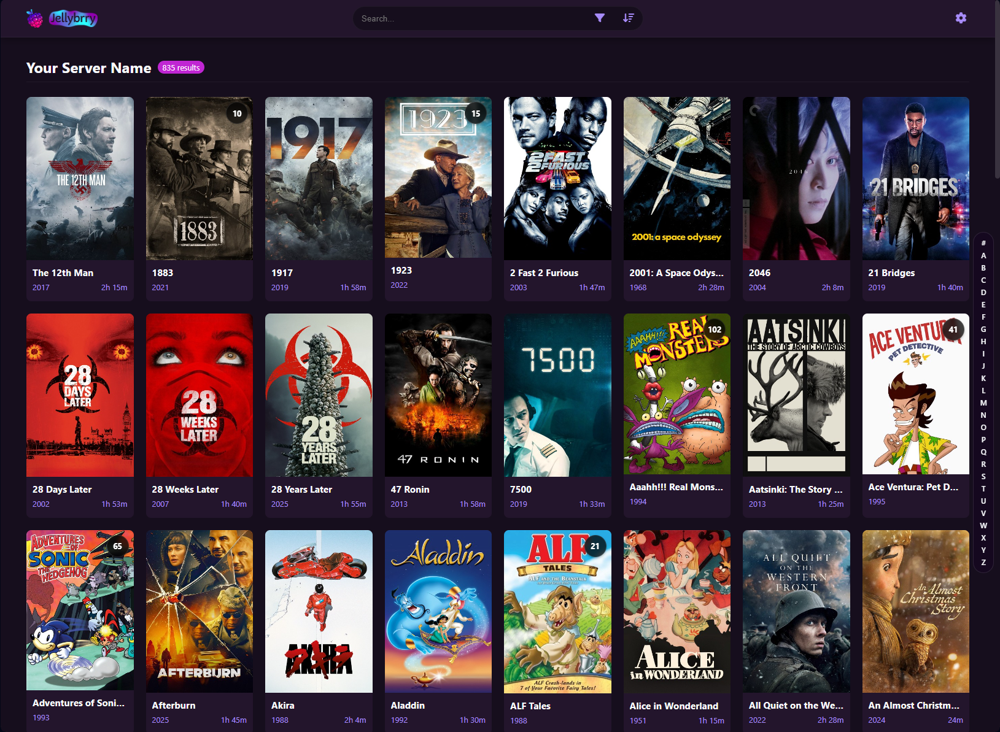
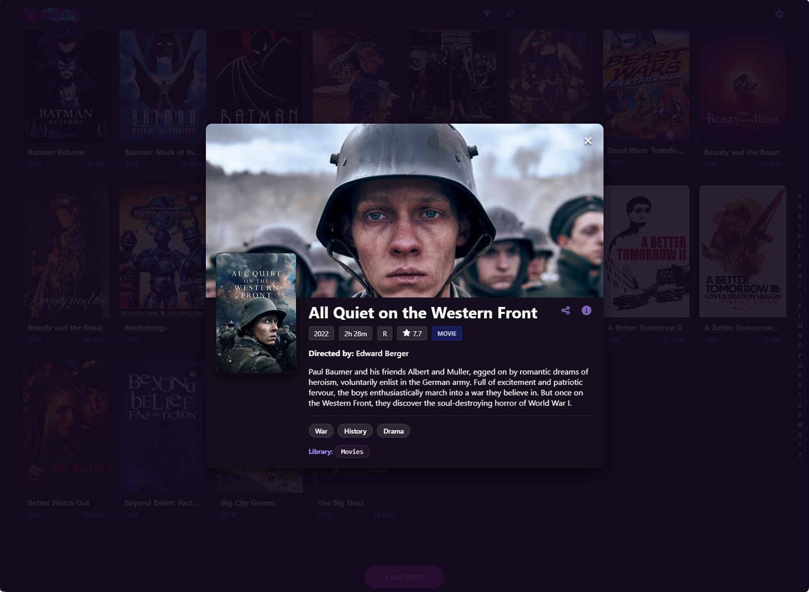
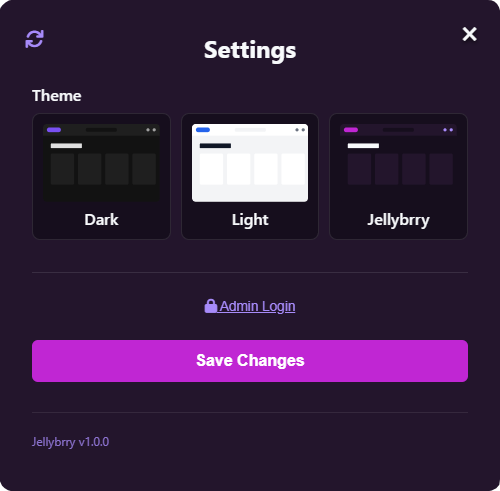
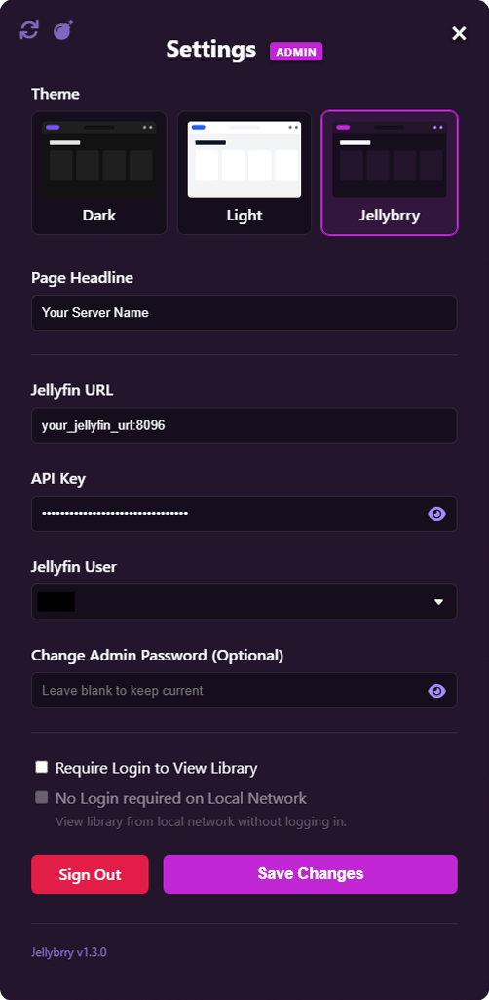
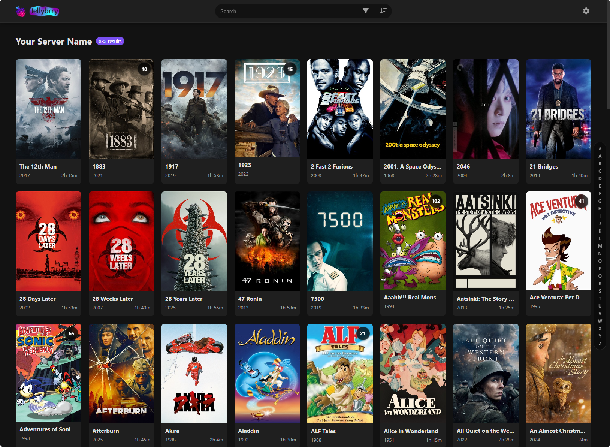
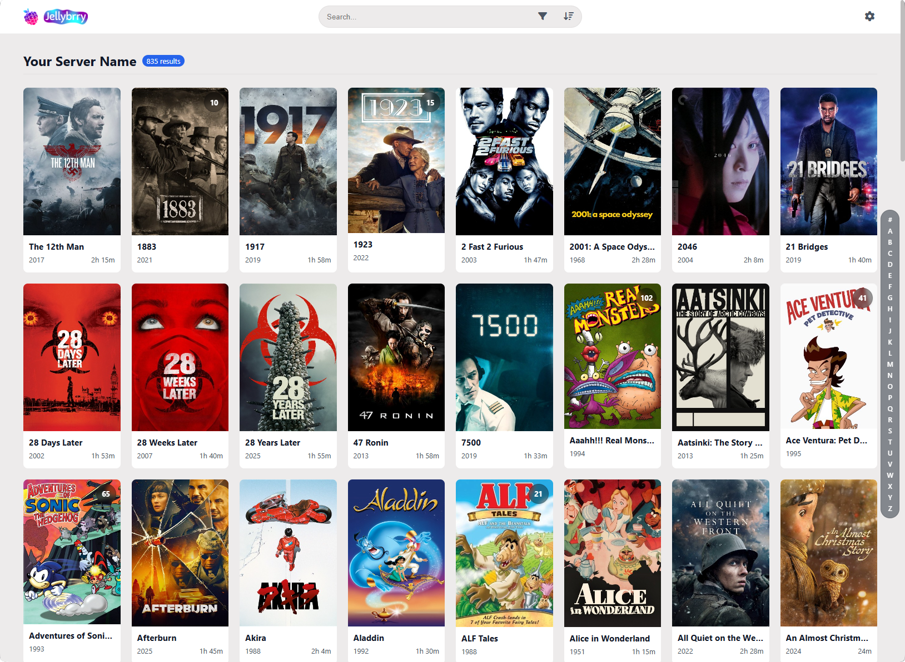
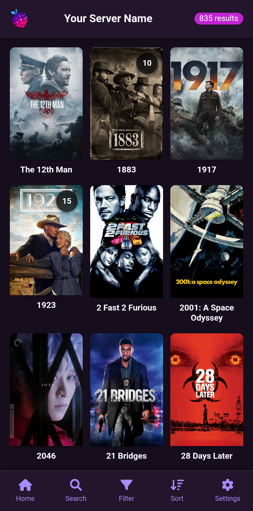
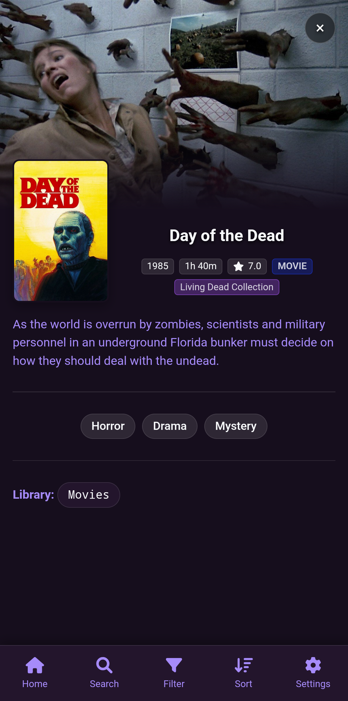
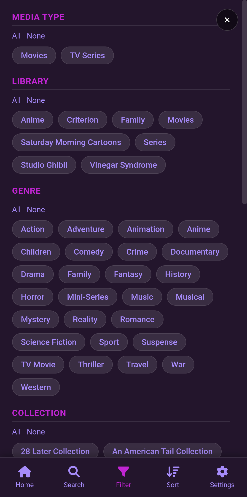
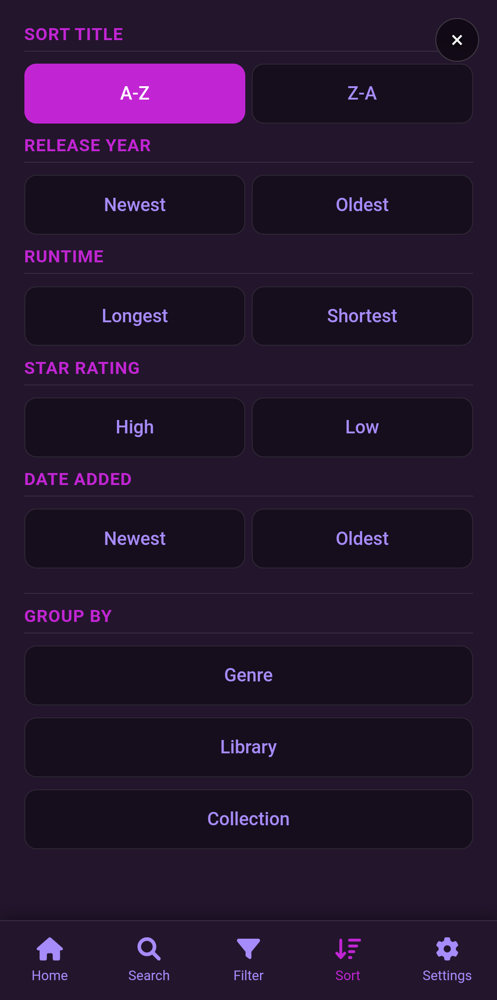

# Jellybrry

A lightweight, filter-focused frontend for Jellyfin media servers.
Designed to help you and your users browse your Jellyfin library with search, sorting and filtering without needing to log in.

## Features
- **No Login Required:** Guests can browse your collection instantly.
- **Advanced Filtering & Sorting:** Filter by Media Type, Jellyfin Library, Genre, and Collection. Sort by Title, Release Year, Runtime, IMDB Rating, Date Added, and group by Genres, Library, or Collection.
- **Admin & Guest Themes:** Set a server-wide theme as admin, which all users will see initially. Guests can override admin-assigned theme for their browser only by changing the theme in Settings without logging in as Admin.
- **Lock Library Visibility Behind Password:** Admins can hide library behind admin password. For servers you don't share with guests.
- **No Login on Home Network Option:** For locked libraries, admins can stay logged in at home.
- **Mobile Optimized:** So guests can browse your library from anywhere.

## Installation: 🐳 Docker (Recommended)

1. **YML:** Copy this `docker-compose.yml` to get started immediately.

   ```yaml
   services:
    jellybrry:
      image: ghcr.io/eightbitmagnets/jellybrry:latest
      container_name: jellybrry
      restart: unless-stopped
      ports:
        - "6070:6070"
      volumes:
        - ./config:/config
      environment:
        - THEME=jellybrry

2. **Customize Theme with Environmental Variable:**
   ```bash
   - THEME=dark
   - THEME=light
   - THEME=jellybrry
2. **Run with Docker Compose:**
   ```bash
   docker compose up -d
4. **Open in Browser:** Go to http://localhost:6070

   **Configuration**
   On first launch, the app will ask for:
   - Jellyfin Server URL
   - Jellyfin API Key
   - Admin Password (for settings)

## Screenshots

### Desktop Dashboard & Settings


<p float="left">
  
  
</p>  

### Themes
<p float="left">
  
  
  
</p>

### Mobile
<p float="left">
  
  
  
  
</p>

**License:** GNU General Public License v3.0
